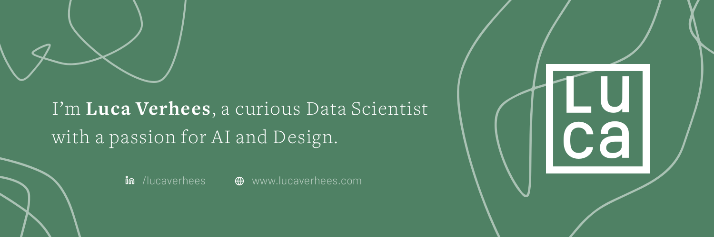

Hello! I’m Luca – a data enthusiast, crafting clarity and innovation through code and creativity.

👩‍💻 &nbsp;&nbsp;As a Senior Data Scientist and Analytics Translator at NS (Dutch Railways), I transform complex data and (Gen)AI into tangible operational impact. We build products directly alongside operational teams, ensuring resources are utilized exactly when and where our passengers and operations need them most. The synergy between people and data fascinates me, especially where numbers meet a dynamic (and often unpredictable) reality.

🌱 &nbsp;&nbsp;With a cum laude MSc in Data Science and an entrepreneurial foundation of 30+ freelance projects, I speak the language of both tech and business. As a mentor for young talent and a data literacy trainer, I gain immense energy from helping others grow.

💬 &nbsp;&nbsp;My goal? To build an inclusive culture where data literacy thrives and we fully dare to experiment, not just through innovative AI pilots, but also on a personal level by seeking out exciting challenges and giving talent the space to flourish. Reading tip: [Designing Your Life by Bill Burnett & Dave Evans](https://www.designingyour.life/).

⚒️ &nbsp;&nbsp;Some of the tools & technologies I work with on a day-to-day basis:

📫 &nbsp;&nbsp;How to reach me: [LinkedIn](https://www.linkedin.com/in/lucaverhees/) or [www.lucaverhees.nl](https://www.lucaverhees.nl).
