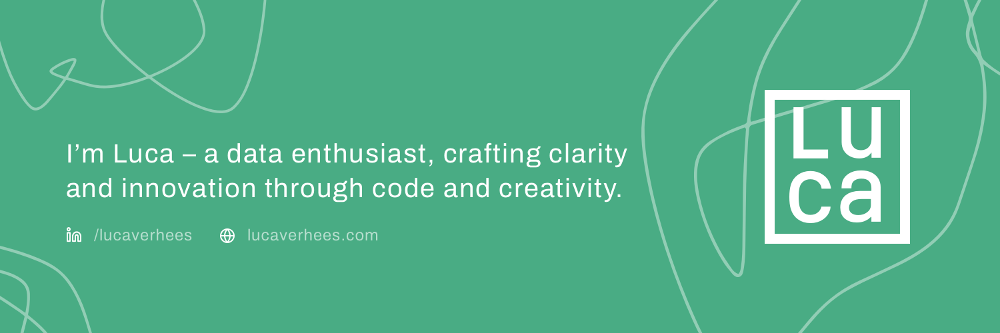

Hi! I'm Luca Verhees, a versatile data scientist who gets excited about solving real-world problems with data solutions and a human-centred approach.

👩‍💻 &nbsp;&nbsp;I’m working as a Data Scientist at <a href="https://www.ns.nl/" style="color:#49AC84;">Nederlandse Spoorwegen</a>, the principal passenger railway operator in the Netherlands.

🌱 &nbsp;&nbsp;I’m currently expanding my knowledge on <a href="https://github.com/lucavh/my-notes/blob/main/azure/DP-100-azure-data-scientist-associate.md" style="color:#49AC84;">data science in Azure</a> and <a href="https://github.com/lucavh/scikit-learn-mooc" style="color:#49AC84;">machine learning with scikit-learn</a>.

💫 &nbsp;&nbsp;I'm passionate about the crossroads between artificial intelligence and design.

💬 &nbsp;&nbsp;Ask me about MLops, time series forecasting, design and UX.

⚒️ &nbsp;&nbsp;Some of the tools & technologies I've worked with:

📫 &nbsp;&nbsp;How to reach me: <a href="https://www.linkedin.com/in/lucaverhees/" style="color:#49AC84;">LinkedIn</a> or <a href="https://www.lucaverhees.nl" style="color:#49AC84;">www.lucaverhees.nl</a>.
